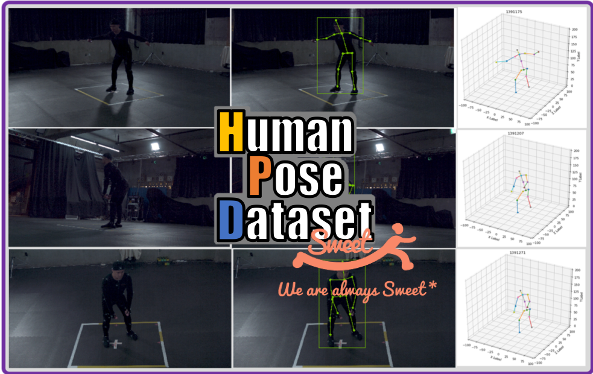
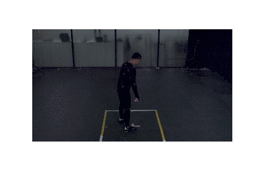
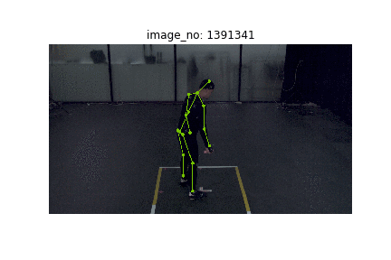

# 사람 동작 영상 AI 데이터 (by Sweetk)



사람 동작 영상 AI 데이터는 사람 동작 영상에 따른 관절좌표(key points) 정보를 포함합니다. 데이터는 20만장 영상클립과 이에 해당하는 관절좌표로 구성되어 있습니다. 각 관절은 이미지 상의 2차원 좌표와 3차원 월드와이드 좌표로 제공되며 데이터 예시는 아래 [그림 1] 과 같습니다.

[그림 1] 사람동작데이터 예시

|ori|2D|3D|
|-|-|-|
| |  | 

* 이미지파일과 json 파일로 제공되는 2차원과 3차원 관절 정보 형식으로 구성
* 왼쪽상단은 원본 이미지이며 좌측하단은 2차원 관절데이터에서 제공하는 2차원 관절정보와 bbox(bounding box) 정보
* 오른쪽은 3차원 관절 데이터는 월드와이드(World Wide) 기준의 3차원 좌표 데이터

## 구축 방법
* 실내, 실외에서 1인에서 4인의 액터가 50여종의 동작을 5~10 초간 연기하며 촬영을 함으로서 동작영상 확보
* 영상으로부터 이미지를 추출하여 2D/3D 관절정보를 가공

## 액션 종류
* 걷기, 달리기, 앉기, 인사 (목례+절), 인사 (손흔들기), 인사 (악수), 포옹, 쓰러짐, 팔짱끼기, 식사동작, 점프, 계단 오르기, 푸쉬업, 방향 지시, 박수치기, 윗몸일으키기, 포복, 싸움, 대화하기, 요가, 댄스 (아이돌) - 여러명, 댄스 (클럽 외) - 여러명, 댄스 (스포츠) - 여러명, 악기연주 (기타), 악기연주 (전자피아노), 악기연주 (드럼), 훌라후프, 웨이트트레이닝, 홈트레이닝, 탁구 (서브), 탁구 (리시브), 야구 (투구), 야구 (배팅), 축구 (드리블), 축구 (슛팅), 골프 (스윙), 골프 (퍼팅), 배드민턴 (서브), 배드민턴 (리시브), 줄넘기, 음료마시기, 핸드폰 조작, 통화, 물건 운반, 담배 피우기, 사진 찍기, 농구, 역도(물건 들어올리기), 펜싱(찌르기), 집안일
* 전체 50종의 액션 중 이번 공개에서는 25종의 액션에 해당

## 디렉토리 구조

```
${ROOT}
|-- api 
|    `-- PythonAPI
|            |-- tools
|            |     `-- utils.py
|            |-- inspect_data_2d.ipynb
|            `-- inspect_data_3d.ipynb
|-- dataset
|      |-- anntation 
|      |        |-- 2d
|      |        `-- 3d
|      `-- images
|-- resource
`-- README.md
```

* API 사용을 위해 `dataset` 폴더 구조를 위와 같이 맞춰야 합니다

## 데이터 다운로드
HumanPoseData는 [[aihub.or.kr](http://www.aihub.or.kr/content/608)] 의 사람 동작 영상 AI 데이터에서 다운로드 가능합니다.

## 참조
This repo is largely modified from repo of [Mask_RCNN](https://github.com/matterport/Mask_RCNN.git)
